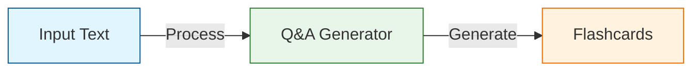
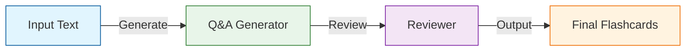
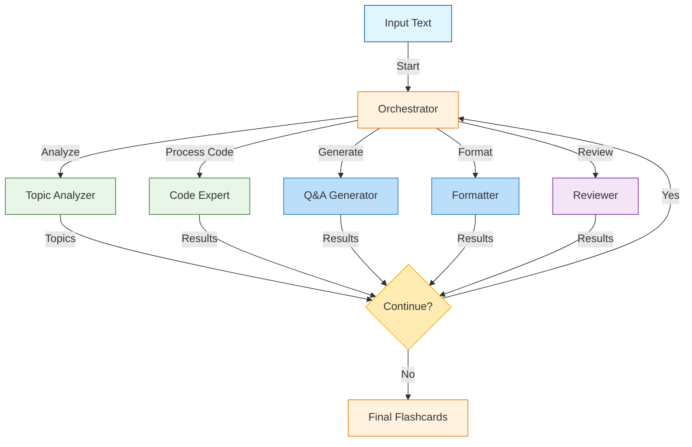

# Building a Multi-Agent Framework from Scratch with LlamaIndex

> **Author**: Eason Meng
>
> **Follow me on**: [LinkedIn](https://www.linkedin.com/in/yusen-meng-4946b6135/) | [Twitter](https://x.com/luluyuyusese)
>
> **Tip**: For a better reading experience, please visit the [full article on GitHub](https://github.com/YukoOshima/Blog/blob/main/articles/multi_agents.md).
>
> **Code**: The complete source code for this tutorial is available in the [GitHub repository](https://github.com/YukoOshima/Blog/tree/main/code/multi_agents).


## Introduction

Multi-agent systems are like teams of specialized workers, each with their own expertise, working together to accomplish complex tasks. In this tutorial, we'll build a multi-agent system using LlamaIndex that generates high-quality Anki flashcards from any given text.

We'll start simple and gradually add more capabilities, similar to how you might build a team - starting with one person and gradually adding more specialists as needed.

## Version 1: Basic Single-Agent System

In our first version, we'll create a simple system with just one agent that can generate Anki flashcards from text. Think of it as hiring your first employee who knows how to create educational content.

### Architecture


### Core Components

Let's break down our code into manageable pieces:

1. **Data Models**: First, we define what our flashcards should look like using Pydantic:
```python
class QACard(BaseModel):
    question: str
    answer: str
    extra: str

class Flashcard_model(BaseModel):
    cards: List[QACard]
```

2. **LLM Setup**: We configure LlamaIndex to use our preferred language model:
```python
def get_shared_llm():
    """Returns a shared LLM instance for all agents."""
    return OpenAI(
        model="gpt-4o-mini", 
        temperature=0,
        api_base="http://127.0.0.1:4000/v1",
        api_key="sk-test"
    )
```

3. **Agent Creation**: Our Q&A Generator agent is specialized in creating flashcards:
```python
def qa_generator_factory() -> OpenAIAgent:
    system_prompt = """
    You are an educational content creator specializing in Anki flashcard generation.
    Your task is to create clear, concise flashcards following these guidelines:

    1. Each card should focus on ONE specific concept
    2. Questions should be clear and unambiguous
    3. Answers should be concise but complete
    4. Include relevant extra information in the extra field
    5. Follow the minimum information principle

    Format each card as:
    <card>
        <question>Your question here</question>
        <answer>Your answer here</answer>
        <extra>Additional context, examples, or explanations</extra>
    </card>
    """

    return OpenAIAgent.from_tools(
        [],
        llm=get_shared_llm(),
        system_prompt=system_prompt,
    )
```

4. **Response Handling**: We use a transformer function to convert the agent's output into structured data:
```python
@retry(stop=stop_after_attempt(3), wait=wait_exponential(multiplier=1, min=4, max=10))
def transformer(message: str) -> dict:
    chat_prompt_tmpl = ChatPromptTemplate(
        message_templates=[
            ChatMessage.from_str(message, role="user")
        ]
    )
    llm = get_shared_llm()
    structured_data = llm.structured_predict(Flashcard_model, chat_prompt_tmpl)
    return structured_data.model_dump()
```

### Main Function

Here's how we put it all together:
```python
def generate_anki_cards(input_text: str) -> dict:
    # Create the agent
    agent = qa_generator_factory()
    
    # Generate flashcards
    response = agent.chat(
        f"Generate Anki flashcards from the following text:\n\n{input_text}"
    )
    
    # Transform the response into structured data
    structured_response = transformer(str(response))
    return structured_response
```

### Example Usage

Let's try it with a sample text about RSI (Relative Strength Index):
```python
sample_text = """
The Relative Strength Index (RSI) is a momentum indicator used in technical analysis.
It measures the speed and magnitude of recent price changes to evaluate overbought
or oversold conditions. RSI is displayed as an oscillator on a scale from 0 to 100.
Readings above 70 generally indicate overbought conditions, while readings below 30
indicate oversold conditions.
"""

flashcards = generate_anki_cards(sample_text)
print(flashcards)
```

### Key Features

1. **Single Responsibility**: Our agent focuses solely on creating flashcards
2. **Data Validation**: Pydantic ensures our data is properly structured
3. **Error Handling**: Retry mechanism helps handle temporary failures
4. **Structured Output**: Consistent XML format for easy parsing
5. **Type Safety**: Python type hints help catch errors early

### Current Limitations

This basic version has some limitations we'll address in future versions:

1. No quality control (no one reviewing the cards)
2. Limited understanding of complex topics
3. No way to handle specialized content (like code examples)
4. No memory of previous messages
5. No way to improve cards based on feedback

In the next version, we'll add a second agent to review and improve the generated flashcards, making our system more robust.

## Version 2: Two-Agent System

In this version, we'll add a second agent - the Reviewer - to improve the quality of our flashcards. Think of it like having a teacher who creates the flashcards (Q&A Generator) and an editor who reviews and improves them (Reviewer).

### Architecture


### New Components

Let's look at what we're adding to our system:

1. **Agent Types**: First, we define our agent types using an Enum:
```python
class Speaker(str, Enum):
    QA_GENERATOR = "Q&A Generator"
    REVIEWER = "Reviewer"
```

2. **Reviewer Agent**: This agent specializes in improving flashcard quality:
```python
def reviewer_factory() -> OpenAIAgent:
    system_prompt = """
    You are the Reviewer agent. Your task is to review and refine Anki flashcards,
    ensuring they follow these rules:

    1. Each card should test ONE piece of information
    2. Questions must be:
       - Simple and direct
       - Testing a single fact
       - Using cloze format when appropriate
    3. Answers must be:
       - Brief and precise
       - Limited to essential information
    4. Extra field must include:
       - Detailed explanations
       - Examples
       - Context
    """

    return OpenAIAgent.from_tools(
        [],
        llm=get_shared_llm(),
        system_prompt=system_prompt,
    )
```

3. **State Management**: We track the progress of our flashcard creation:
```python
def get_initial_state(text: str) -> dict:
    return {
        "input_text": text,
        "qa_cards": "",
        "review_status": "pending"
    }
```

### Main Function

Here's how we combine both agents:
```python
def generate_anki_cards(input_text: str) -> dict:
    # Initialize state
    state = get_initial_state(input_text)
    
    # Step 1: Generate initial cards
    generator = qa_generator_factory()
    response = generator.chat(
        f"Generate Anki flashcards from the following text:\n\n{state['input_text']}"
    )
    state["qa_cards"] = str(response)
    
    # Step 2: Review and improve cards
    reviewer = reviewer_factory()
    review_response = reviewer.chat(
        f"Review and improve these flashcards:\n\n{state['qa_cards']}"
    )
    state["qa_cards"] = str(review_response)
    
    # Transform final cards into structured data
    return transformer(state["qa_cards"])
```

### Example Usage

Let's see how it works with our RSI example:
```python
sample_text = """
The Relative Strength Index (RSI) is a momentum indicator used in technical analysis.
It measures the speed and magnitude of recent price changes to evaluate overbought
or oversold conditions. RSI is displayed as an oscillator on a scale from 0 to 100.
Readings above 70 generally indicate overbought conditions, while readings below 30
indicate oversold conditions.
"""

flashcards = generate_anki_cards(sample_text)
```

### Example Output

Here's what the process looks like:

1. **Initial Generation**:
```xml
<cards>
    <card>
        <question>What is RSI in technical analysis?</question>
        <answer>A momentum indicator that measures speed and magnitude of recent price changes</answer>
        <extra>Used to evaluate overbought/oversold conditions</extra>
    </card>
</cards>
```

2. **After Review**:
```xml
<cards>
    <card>
        <question>RSI (Relative Strength Index) is a _____ indicator in technical analysis.</question>
        <answer>momentum</answer>
        <extra>
        Key points about RSI:
        - Measures speed/magnitude of price changes
        - Scale: 0 to 100
        - Overbought: Above 70
        - Oversold: Below 30
        </extra>
    </card>
</cards>
```

### Key Improvements

1. **Quality Control**: The Reviewer agent ensures better card quality
2. **Better Format**: Cloze deletions for more effective learning
3. **Richer Context**: More detailed extra field content
4. **Progress Tracking**: State management shows card status
5. **Consistent Structure**: XML format maintained throughout

### Current Limitations

While better than Version 1, this system still has some limitations:

1. No way to analyze complex topics
2. Basic two-step process (could be more sophisticated)
3. No memory of previous messages
4. Limited error handling
5. No way to handle specialized content (like code)

In Version 3, we'll add more agents to handle these limitations and create a more robust system.

## Version 3: Multi-Agent Orchestra

In this version, we enhance our system by enabling multiple agents to collaborate effectively. Each agent has a specific role, and they work together to create high-quality flashcards. The Orchestrator agent plays a crucial role in managing this collaboration, ensuring that each agent contributes at the right time. Additionally, the Topic Analyzer helps break down complex topics into simpler parts, providing a structured overview of the content.

### How Multi-Agent Collaboration Works

In a multi-agent system, each agent is like a team member with a specific expertise. Here's how they collaborate:

1. **Specialized Roles**: Each agent is designed to perform a specific task. For example, the Q&A Generator creates flashcards, while the Reviewer ensures their quality.

2. **Sequential Processing**: Agents work in a sequence, with each one building on the output of the previous agent. This ensures that the final product is refined and comprehensive.

3. **Dynamic Decision-Making**: The Orchestrator agent decides which agent should work next based on the current state of the process. This allows the system to adapt to the needs of the content dynamically.

4. **Shared Context**: A memory system maintains context across interactions, allowing agents to make informed decisions based on previous outputs.

### Introducing the Orchestrator Agent

The Orchestrator is the manager of our multi-agent system. It coordinates the workflow, ensuring that each agent contributes effectively. Here's how it works:

#### Orchestrator's Role

- **Decision-Making**: The Orchestrator evaluates the current state and decides which agent should run next. It ensures that the workflow is efficient and that all necessary tasks are completed.

- **Flexibility**: The Orchestrator can choose any agent at any time, allowing for a flexible and adaptive process. It can run agents multiple times if needed or skip steps if the content is already complete.

- **End Condition**: The Orchestrator decides when the process is complete, ensuring that the final flashcards are comprehensive and high-quality.

#### Orchestrator Implementation

Here's how we implement the Orchestrator:

```python
def orchestrator_factory(state: dict) -> OpenAIAgent:
    system_prompt = f"""
    You are the Orchestrator agent. Your task is to coordinate the interaction between all agents to create high-quality flashcards.

    Current State:
    {pformat(state, indent=2)}

    Available agents:
    * Topic Analyzer - Breaks down complex topics
    * Q&A Generator - Creates flashcards
    * Reviewer - Improves card quality
    
    Decision Guidelines:
    - Use Topic Analyzer first for topic breakdown
    - Use Q&A Generator to create cards
    - Use Reviewer to refine cards
    - Choose END when the cards are ready

    Output only the next agent to run ("Topic Analyzer", "Q&A Generator", "Reviewer", or "END")
    """
    return OpenAIAgent.from_tools(
        [],
        llm=get_shared_llm(),
        system_prompt=system_prompt,
    )
```

### Introducing the Topic Analyzer Agent

The Topic Analyzer is responsible for breaking down complex topics into manageable parts. It provides a structured overview of the content, which helps in creating more focused and comprehensive flashcards.

#### Topic Analyzer's Role

- **Content Breakdown**: The Topic Analyzer identifies key topics and subtopics from the input text, helping to structure the content.

- **Hierarchical Structuring**: It creates a hierarchical structure of topics, making it easier to understand the relationships between different concepts.

- **Application Suggestions**: The agent suggests real-world applications or case studies related to the topics, enriching the flashcards with practical insights.

#### Topic Analyzer Implementation

Here's how we implement the Topic Analyzer:

```python
def topic_analyzer_factory(state: dict) -> OpenAIAgent:
    system_prompt = f"""
    You are the Topic Analyzer agent. Your task is to analyze the given text and identify key topics for flashcard creation.
    
    Current State:
    {pformat(state, indent=2)}
    
    Instructions:
    1. Identify main concepts and sub-concepts
    2. Create a structured list of topics
    3. Suggest real-world applications

    Output format:
    <topics>
        <topic>
            <name>Main topic name</name>
            <subtopics>
                <subtopic>Subtopic 1</subtopic>
                <subtopic>Subtopic 2</subtopic>
            </subtopics>
        </topic>
    </topics>
    """
    return OpenAIAgent.from_tools(
        [],
        llm=get_shared_llm(),
        system_prompt=system_prompt,
        verbose=True
    )
```

### Main Function

The main function now includes the Orchestrator, which dynamically decides the workflow:

```python
def generate_anki_cards(input_text: str) -> dict:
    # Initialize state and memory
    state = get_initial_state(input_text)
    memory = setup_memory()
    
    while True:
        # Get current chat history
        current_history = memory.get()
        
        # Let Orchestrator decide next step
        orchestrator = orchestrator_factory(state)
        next_agent = str(orchestrator.chat(
            "Decide which agent to run next based on the current state.",
            chat_history=current_history
        )).strip().strip('"').strip("'")
        print(f"\nOrchestrator selected: {next_agent}")
        
        if next_agent == "END":
            print("\nOrchestrator decided to end the process")
            break
        
        # Execute selected agent
        try:
            if next_agent == Speaker.TOPIC_ANALYZER.value:
                analyzer = topic_analyzer_factory(state)
                response = analyzer.chat(
                    f"Analyze this text for flashcard topics:\n\n{state['input_text']}",
                    chat_history=current_history
                )
                state["topics"] = str(response)
                print("\nTopic Analysis Results:")
                print(state["topics"])
                
            elif next_agent == Speaker.QA_GENERATOR.value:
                generator = qa_generator_factory()
                response = generator.chat(
                    f"Generate flashcards for this topic:\n\n{state['topics']}",
                    chat_history=current_history
                )
                state["qa_cards"] = str(response)
                state["review_status"] = "needs_review"
                print("\nGenerated Cards:")
                print(state["qa_cards"])
                
            elif next_agent == Speaker.REVIEWER.value:
                reviewer = reviewer_factory()
                response = reviewer.chat(
                    f"Review these flashcards:\n\n{state['qa_cards']}",
                    chat_history=current_history
                )
                state["qa_cards"] = str(response)
                state["review_status"] = "reviewed"
                print("\nReviewed Cards:")
                print(state["qa_cards"])
                
                # Update memory with new interaction
                memory.put(ChatMessage(role="assistant", content=str(response)))
                print(f"\nUpdated memory with {next_agent}'s response")
            
        except Exception as e:
            print(f"\nError in {next_agent}: {str(e)}")
            continue
        
    # Transform final cards into structured data
    final_cards = transformer(state["qa_cards"])
    return final_cards
```

### Example Usage

Here's how the orchestrated system works with our RSI example:

```python
if __name__ == "__main__":
    sample_text = """
    The Relative Strength Index (RSI) is a momentum indicator used in technical analysis.
    It measures the speed and magnitude of recent price changes to evaluate overbought
    or oversold conditions. RSI is displayed as an oscillator on a scale from 0 to 100.
    Readings above 70 generally indicate overbought conditions, while readings below 30
    indicate oversold conditions. The RSI can also help identify divergences, trend lines,
    and failure swings that may not be apparent on the underlying price chart.
    """
    
    flashcards = generate_anki_cards(sample_text)
    print("\nGenerated, Analyzed, and Reviewed Flashcards:")
    print(flashcards)
```

### Key Improvements

1. **Coordinated Workflow**: The Orchestrator manages agent interactions, ensuring a smooth and efficient process.
2. **Topic Analysis**: The Topic Analyzer provides a deeper understanding of content structure, leading to more comprehensive flashcards.
3. **Persistent Memory**: Context is maintained across interactions, allowing for more informed decision-making.
4. **Flexible Execution**: The Orchestrator dynamically selects agents based on the current state, adapting to the needs of the content.
5. **Hierarchical Processing**: Topics are broken down into manageable chunks, making it easier to create detailed and accurate flashcards.

### Limitations

While this version is more sophisticated, it still has some areas for improvement:

1. No specialized handling of code examples
2. Limited formatting options
3. Basic error handling

In Version 4, we'll introduce the Code and Extra Field Expert agent and a Formatter agent to handle code examples and ensure consistent formatting. We'll also improve error handling and add support for different content types.

## Version 4: Enhanced Capabilities

In this version, we introduce two new agents: the Code and Extra Field Expert and the Formatter. These agents handle code examples and ensure consistent formatting, respectively. We also improve error handling and add support for different content types.

### Architecture



### New Components

#### 1. Updated Agent Types

We expand our agent types to include the new roles:

```python
class Speaker(str, Enum):
    QA_GENERATOR = "Q&A Generator"
    REVIEWER = "Reviewer"
    TOPIC_ANALYZER = "Topic Analyzer"
    ORCHESTRATOR = "Orchestrator"
    CODE_AND_EXTRA_FIELD_EXPERT = "Code and Extra Field Expert"
    FORMATTER = "Formatter"
```

#### 2. Code and Extra Field Expert

This agent enhances flashcards with code examples and detailed explanations:

```python
def code_and_extra_field_expert_factory() -> OpenAIAgent:
    system_prompt = """
    You are the Code and Extra Field Expert agent. Your task is to enhance Anki flashcards
    by adding relevant code snippets and comprehensive extra content.

    Instructions:
    1. Add clear, concise code examples that illustrate key concepts
    2. Ensure code snippets are well-commented and easy to understand
    3. In the extra field, provide:
       - Step-by-step explanations of code snippets 
       - Common use cases and scenarios
       - Potential pitfalls and edge cases
       - Best practices and optimization tips
    4. Use appropriate markdown formatting for code blocks
    5. Include relevant documentation links
    6. Ensure explanations are clear for a 15-year-old
    """
    return OpenAIAgent.from_tools(
        [],
        llm=get_shared_llm(),
        system_prompt=system_prompt,
    )
```

#### 3. Formatter Agent

This agent ensures that the flashcards are properly formatted:

```python
def formatter_agent_factory() -> OpenAIAgent:
    system_prompt = """
    You are the Formatter agent. Your task is to ensure proper XML structure and markdown
    formatting in the flashcards.

    Formatting Rules:
    1. Maintain valid XML structure
    2. Properly escape special characters
    3. Format code blocks with appropriate language tags
    4. Use consistent indentation
    5. Ensure markdown compatibility
    6. Preserve code snippets exactly as provided
    7. Handle nested structures properly
    """
    return OpenAIAgent.from_tools(
        [],
        llm=get_shared_llm(),
        system_prompt=system_prompt,
    )
```

### Enhanced Error Handling and Validation

We improve error handling with retries and validation:

```python
@retry(stop=stop_after_attempt(3), wait=wait_exponential(multiplier=1, min=4, max=10))
def validate_and_transform(message: str) -> dict:
    try:
        # Transform to structured data
        chat_prompt_tmpl = ChatPromptTemplate(
            message_templates=[
                ChatMessage.from_str(message, role="user")
            ]
        )
        structured_data = get_shared_llm().structured_predict(
            Flashcard_model, 
            chat_prompt_tmpl
        )
        return structured_data.model_dump()
        
    except ET.ParseError as e:
        print(f"XML validation error: {str(e)}")
        raise TryAgain
    except Exception as e:
        print(f"Transformation error: {str(e)}")
        raise TryAgain
```

### Example Usage

Here's how the enhanced system works with a sample text that includes code:

```python
if __name__ == "__main__":
    sample_text = """
    To calculate the RSI (Relative Strength Index) in Python, you typically use 
    technical analysis libraries like pandas-ta or the ta library. The RSI is 
    calculated using the average gains and losses over a specified period 
    (usually 14 periods). Here's how you can implement it:

    1. Using the ta library:
    ```python
    import pandas as pd
    import ta
    
    # Assuming you have price data in a DataFrame
    df['RSI'] = ta.momentum.RSIIndicator(
        close=df['close'],
        window=14
    ).rsi()
    ```

    2. Manual implementation:
    ```python
    def calculate_rsi(data, periods=14):
        delta = data.diff()
        gain = (delta.where(delta > 0, 0)).rolling(
            window=periods).mean()
        loss = (-delta.where(delta < 0, 0)).rolling(
            window=periods).mean()
        rs = gain / loss
        return 100 - (100 / (1 + rs))
    ```
    """
    
    flashcards = generate_anki_cards(sample_text)
    print("Generated Flashcards with Code Examples:")
    print(flashcards)
```

### Key Improvements

1. **Code Handling**: Specialized agent for code examples and explanations
2. **Consistent Formatting**: Dedicated formatter agent
3. **Robust Error Handling**: Improved validation and retries
4. **Rich Extra Content**: Comprehensive explanations and best practices
5. **Markdown Support**: Proper formatting of code blocks and text

## Conclusion

Throughout this tutorial, we've built a sophisticated multi-agent system for generating Anki flashcards, progressing from a simple single-agent implementation to a complex orchestrated system. Let's recap the key developments across each version:

### Evolution of the System

1. **Version 1: Basic Single-Agent**
   - Established core data structures
   - Implemented basic flashcard generation
   - Set up error handling foundation

2. **Version 2: Two-Agent Interaction**
   - Added quality control through review process
   - Introduced state management
   - Implemented iterative refinement

3. **Version 3: Multi-Agent Orchestra**
   - Added orchestration layer
   - Implemented topic analysis
   - Enhanced context management through memory system

4. **Version 4: Enhanced Capabilities**
   - Added specialized code handling
   - Implemented consistent formatting
   - Enhanced error handling and validation

### Key Takeaways

1. **Modular Design**
   - Each agent has a specific responsibility
   - Easy to add new agents or modify existing ones
   - Clear separation of concerns

2. **Robust Architecture**
   - State management across agents
   - Error handling and retry mechanisms
   - Memory system for context preservation

3. **Quality Control**
   - Multiple layers of review and refinement
   - Consistent formatting and structure
   - Rich content with code examples and explanations

### Future Enhancements

While our system is already quite capable, there are several potential areas for future improvement:

1. **Parallel Processing**
   - Implement concurrent card generation
   - Add batch processing capabilities
   - Optimize for large-scale operations

2. **Advanced Features**
   - Image handling and processing
   - Multi-language support
   - Audio content integration
   - Interactive examples

3. **Learning Capabilities**
   - Feedback incorporation
   - Quality metrics tracking
   - Adaptive prompt refinement

4. **Integration Options**
   - API endpoints
   - Web interface
   - Direct Anki integration
   - Version control for cards

### Final Thoughts

Building a multi-agent system requires careful consideration of agent interactions, state management, and error handling. This tutorial has demonstrated how to incrementally build such a system, starting from basic components and progressively adding sophistication.

The final system showcases the power of combining multiple specialized agents, each with its own expertise, to create a robust and flexible solution. While the focus has been on Anki flashcard generation, the patterns and principles demonstrated here can be applied to many other multi-agent applications.

Remember that the key to successful multi-agent systems lies in:
- Clear agent responsibilities
- Robust communication patterns
- Comprehensive error handling
- Flexible state management
- Consistent output formatting

By following these principles and the patterns demonstrated in this tutorial, you can build your own multi-agent systems for various applications beyond flashcard generation.
