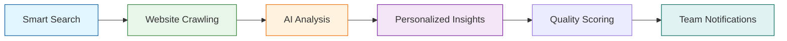

# An Automated Lead Generation Approach That Could Find 50+ B2B Prospects Daily

> **Author**: Eason Meng
>
> **Follow me on**: [LinkedIn](https://www.linkedin.com/in/yusen-meng-4946b6135/) | [Twitter](https://x.com/luluyuyusese)
>
> **Tip**: For a better reading experience, please visit the [full article on GitHub](https://github.com/YukoOshima/Blog/blob/main/articles/outbound_leads.md).
>
> **Resources**: Firecrawl n8n Integration Guide: [https://www.firecrawl.dev/blog/firecrawl-n8n-web-automation](https://www.firecrawl.dev/blog/firecrawl-n8n-web-automation)

## The Challenge Most B2B Teams Face

I recently came across an interesting problem that many B2B teams are struggling with. Most sales and business development professionals spend hours every day manually searching for potential customers. They open LinkedIn, Google random industry keywords, visit company websites one by one, and try to figure out if prospects are a good fit for their product. By the end of the day, they might have 10-15 prospects, and honestly, half of them aren't even that great.

The math is quite depressing when you think about it. If someone can only find 10 prospects a day with a conversion rate around 2%, they're looking at one customer every five days. That's roughly 6 customers per month. For businesses targeting $30K+ monthly revenue, that approach simply doesn't scale.

This got me thinking about an automated approach using n8n, Firecrawl, and Claude AI. In theory, such a system could find 50+ qualified prospects daily with minimal manual effort. More importantly, because AI handles the heavy lifting on qualification, conversion rates could potentially jump to around 8%.

## How This System Could Work

The beauty of this approach is that it mimics exactly what people do manually, but at 10x the speed and with much better analysis. Here's how it could flow:

Instead of manually typing keywords into Google, the system would do intelligent searches using combinations like "SaaS companies + recently funded" or "marketing agencies + hiring developers." It's not just throwing random searches either - it would be strategic about finding companies that match an ideal customer profile.

Once Firecrawl finds these companies, it wouldn't just grab their homepage. It would intelligently crawl through their About pages, team sections, recent blog posts, and even their pricing pages. This would give you a complete picture of who they are, what they do, and how much they might be willing to spend.



Here's where Claude AI comes in and does something that would be impossible to do manually at scale. For each company, it could analyze all the collected information and provide:

What problems this company likely has that your product could solve. For example, if you see they're hiring a lot of developers but their careers page mentions "fast-paced environment," Claude might identify scaling challenges.

How good of a fit they are based on industry, company size, and tech stack. A 50-person fintech company using React might score a 9/10 for developer tools, while a 5-person local restaurant might score a 2/10.

The best angle to approach them with. Instead of generic outreach, you'd get specific talking points like "They just raised Series A and are likely struggling with technical debt as they scale."

What their budget range probably looks like. A company that just raised $10M would have different purchasing power than a bootstrapped startup.

## The Magic Would Be in the Personalization

The game-changer would be that every prospect comes with a personalized value proposition. Instead of sending generic "Hey, want to see our product?" emails, you could send messages like:

"Hi [Name], I noticed you recently expanded to 15 engineers and are hiring aggressively. Most companies at your stage struggle with code review bottlenecks that slow down deployments. Our tool has helped similar fintech companies reduce review time by 60%. Worth a quick chat?"

That level of personalization at scale is what could drive much higher conversion rates.

## What This Would Look Like in Practice

Let me walk you through a theoretical example. Say you're selling developer tools to fintech companies.

The system would search for "fintech startups hiring developers" and find 50 companies. Firecrawl would visit each website and pull information about their tech stack, team size, recent funding, and job postings.

Claude would analyze all this data and identify that TechCorp (fake name) is a Series A fintech with 25 employees, using React and Node.js, recently posted 5 developer jobs, and their CEO just wrote a blog post about "scaling challenges."

Based on this analysis, Claude could generate a personalized approach: "This company is in rapid growth mode, likely struggling with code quality and deployment speed. Approach angle: help them maintain code quality while scaling their team. Estimated budget: $5K-15K/month. Best contact: Engineering Manager (found on their team page)."

When this lands in your Slack or notification system, you'd have everything needed to write a compelling, personalized outreach message.

## Taking It to the Next Level

Once you have the basic system running, there are some advanced features that can really multiply your results.

The first is competitive intelligence. Instead of just finding random prospects, you can specifically target your competitors' customers. The system can search for companies mentioning competitor tools on their websites or job postings, then analyze whether they might be good candidates for switching.

I've also added social media monitoring that tracks LinkedIn company updates, recent hires in key positions, and funding announcements. When a company gets new funding or hires a new CTO, that's often the perfect time to reach out with your product.

The email automation piece is where things get really interesting. The system doesn't just find prospects and analyze them - it can actually generate the first outreach email and set up follow-up sequences. Of course, I still review everything before it goes out, but having a personalized draft ready saves tons of time.

## The Potential Impact

Let's look at the numbers to understand why this approach could be so powerful.

With traditional manual prospecting, a person might spend 3-4 hours researching companies and end up with maybe 10 prospects. With a conversion rate around 2%, that means roughly one new customer every five days.

In contrast, an automated system could run in the background and deliver 50+ qualified prospects daily. Because Claude would do such a good job with the initial qualification and personalization, conversion rates could potentially jump to 8%. Instead of 6 customers per month from manual work, you'd be looking at 120+ qualified opportunities.

The time savings alone would be incredible. What used to take 4 hours could take about 30 minutes each morning to review the prospects and customize the final outreach messages.

## How to Actually Build This

If you want to set this up yourself, here's the technical overview. The whole thing runs on n8n, which is like Zapier but more powerful for complex workflows.

For the web scraping, I use Firecrawl because it handles JavaScript-heavy sites better than traditional scrapers and has built-in n8n integration. You can set it up with either HTTP requests (which I recommend) or their community node if you're self-hosting n8n.

Here's a simplified version of the Firecrawl API call:

```json
{
  "method": "POST",
  "url": "https://api.firecrawl.dev/v0/scrape",
  "headers": {
    "Authorization": "Bearer fc-YOUR_API_KEY",
    "Content-Type": "application/json"
  },
  "body": {
    "url": "{{ $json.company_url }}",
    "extractorOptions": {
      "extractionPrompt": "Extract company information including: company name, industry, employee count, recent news, contact information, and technology mentions."
    }
  }
}
```

For the AI analysis, I send all the scraped data to Claude with a prompt like this:

```
Analyze this company and provide:
1. What business problems they likely have
2. How well our [product] would solve their problems (1-10 score)
3. Estimated budget range
4. Best approach for outreach
5. Personalized value proposition

Company Data: [scraped information]
```

The filtering and notification parts are just standard n8n nodes. I use the Filter node to only keep prospects that score above 7/10, then send the good ones to Slack with all the analysis included.

## Things to Keep in Mind

When you're building something like this, there are a few important considerations. First, be respectful with your scraping. Don't hammer websites with requests - add delays between calls and respect robots.txt files. Most sites won't mind reasonable scraping for business development, but you don't want to be the person who crashes someone's server.

Data privacy is another big one. Make sure you're compliant with GDPR, CCPA, and other regulations. I anonymize personal data where possible and have clear data retention policies.

The AI prompts are probably the most important part to get right. I spent weeks tweaking the Claude prompts to get consistent, high-quality analysis. Start simple and gradually add more criteria as you see what works.

## Why Claude AI Works Best

While you can technically use any AI model for the analysis part - GPT-4, Gemini, or even open-source models - I've tested most of them extensively and Claude consistently delivers the best results for this use case.

Claude excels at understanding nuanced business contexts and generating natural, personalized messaging that doesn't sound robotic. It's particularly good at identifying pain points from limited company information and creating compelling value propositions that actually resonate with prospects.

That said, the system is flexible. If you prefer a different model or want to experiment, you can easily swap out the API calls. Just keep in mind that you'll likely need to adjust your prompts significantly since each model has different strengths and quirks.

## Common Issues and How to Fix Them

The biggest problem I ran into early on was getting too many low-quality leads. The solution was being more specific with my search keywords and adding additional filters in the AI analysis step.

Rate limiting from websites is another common issue. The solution is to add random delays between requests and rotate through different search approaches.

If you're getting inconsistent results from Claude, it's usually a prompt problem. The more specific and structured your prompt, the more consistent the results.

## What's Next for This System

I'm constantly adding new features. The latest addition is integration with LinkedIn Sales Navigator to pull additional company information and find specific contact details.

I'm also experimenting with image analysis to understand company culture from their website photos and social media. It sounds weird, but you can actually learn a lot about a company's stage and priorities from how they present themselves visually.

The email automation is getting more sophisticated too. Instead of just generating one outreach email, the system now creates entire sequence campaigns with different angles and follow-up timing.

## Final Thoughts

Building this automated lead generation system has been one of the highest-impact projects I've worked on. It's transformed our sales process from a manual, time-consuming grind into a scalable, data-driven machine.

The best part is that it gets better over time. As I feed successful and unsuccessful outcomes back into the system, the AI gets better at identifying what makes a good prospect for our specific product.

If you're spending hours every week manually prospecting, I highly recommend building something like this. Start simple with just the basic search and scraping, then gradually add the AI analysis and personalization features.

The tools are all there and more accessible than ever. You just need to put in the time to set it up properly.